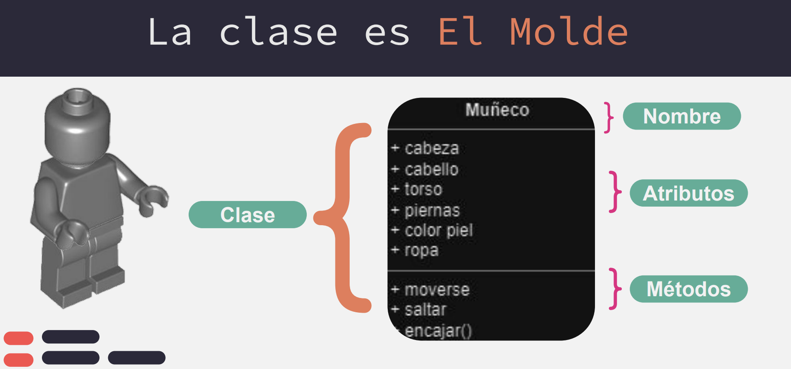
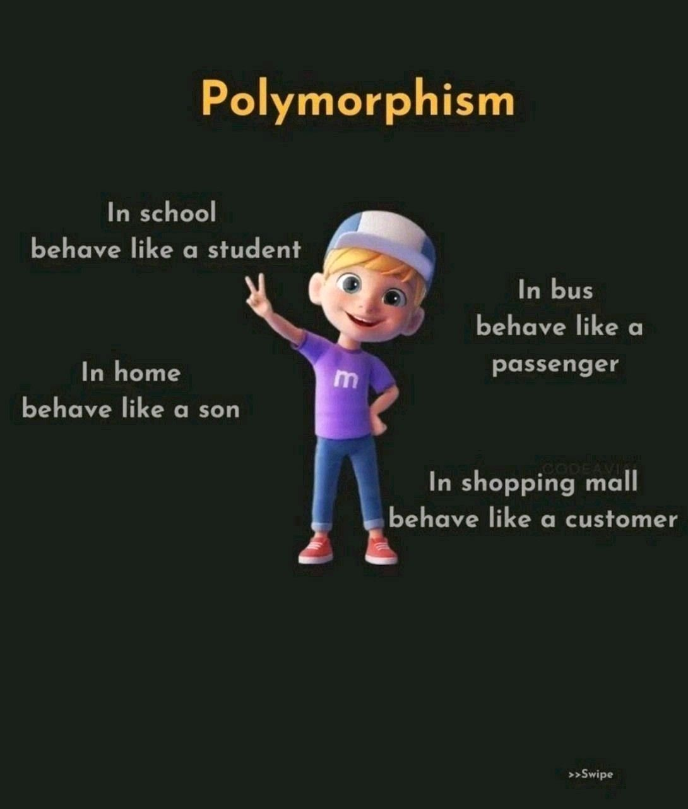

# 💻 Programación Orientada a Objetos con Python

<kbd></kbd>


## 🔍 Índice

*   [✨ Introducción](#introduccion)
*   [🔬 Conceptos Fundamentales](#conceptos-fundamentales)
    *   [🏷️ Clases](#clases)
    *   [📁 Propiedades](#propiedades)
    *   [⚙️ Métodos](#metodos)
    *   [👨‍🎓 Herencia](#herencia)
    *   [🎨 Polimorfismo](#polimorfismo)
    *   [🏛️ Abstracción](#abstraccion)
    *   [🛠️ Encapsulamiento](#encapsulamiento)
    *   [📦 Composición y asociación](#composicio-y-asociacion)
    *   [👨‍🎓 Principios SOLID](#principios-solid)
*   [🎯 Conclusión](#conclusion)
*   [🛠️ Taller](#taller)

## ✨ Introducción 

La **Programación Orientada a Objetos (POO)** es un paradigma que estructura el código en "objetos", los cuales combinan **datos** (atributos) y **acciones** (métodos). Permite modelar el mundo real de manera intuitiva, mejorando la reutilización, el mantenimiento y la escalabilidad del software. Este enfoque facilita la reutilización, el mantenimiento y la escalabilidad del software.


<kbd></kbd>

Ejemplo:
  - **Clase:** "El plano de la casa (Molde para crear objetos)"
  - **Objeto:** "Casa"
  - **Atributos:** color, tamaño, número de habitaciones
  - **Métodos:** abrir_puerta(), cerrar_ventana(), encender_luz()

Es la manera en la que vamos a pensar a la hora de picar código y también tiene una sintaxis y unos elementos propios para cada lenguaje que debemos conocer. Son preguntas técnicas incluso antes de una entrevista.

Python es multiparadigma: funcional, orientado a eventos, orientado a objetos. Aunque Python está diseñado principalmente como un lenguaje orientado a objetos. Todo en Python es un objeto, incluyendo funciones, números, cadenas y listas.  Python no es puramente funcional como Haskell, ni puramente orientado a objetos como Java, sino un equilibrio entre ambos. 

Además, es un lenguaje interpretado y dinámico, lo que permite modificar objetos en tiempo de ejecución sin necesidad de compilación previa.

> [!TIP]
> 🚨 ¿Qué característica distingue a Python como un lenguaje dinámico e interpretado?
>- 🔵 Permite modificar objetos en tiempo de ejecución sin necesidad de compilación previa.
>- 🔴 Requiere compilar el código antes de ejecutarlo, como en C o Java.
>- 🟢 No permite cambiar los atributos de los objetos una vez creados.

## 🔬 Conceptos Fundamentales 

  ### 🏷️ Clases

En Python, una clase es una plantilla para crear objetos. Define las propiedades (atributos) y las acciones (métodos) que los objetos tendrán.

```python
class Person: #Los nombres de las clases de Python se escriben en notación CapitalizedWords por convención. 
  def __init__(self, name, age): #__init__ es el constructor, la función especial que se ejecuta al crear una instancia de la clase.
    self.name = name # Atributo de instancia
    self.age = age # Atributo de instancia

  def introduce(self): #self es la referencia al objeto actual y permite acceder a sus atributos y métodos.
    return f"Hello, I am {self.name} and I am {self.age} years old."
```

```python
person = Person("Alice", 30)
print(person.introduce())
```

🎭 Cada instancia es única. Aunque dos objetos tengan los mismos valores, son diferentes en memoria.
```python
a = Person('Ana', 25)
b = Person('Ana', 25)
print(a == b)  # False (son objetos distintos en memoria)
```

🔄 Objetos mutables. Los atributos de una instancia pueden cambiar en tiempo de ejecución
```python
a.age = 10
```

También es importante diferencias tipos de clases:

| **Tipo de Clase**            | **Descripción**                                         |
|-----------------------------|-----------------------------------------------------|
| **Clases Normales**         | Clases estándar con atributos y métodos.           |
| **Clases Abstractas**       | No pueden ser instanciadas, sirven como plantilla. |
| **Clases de Datos (`dataclass`)** | Generan métodos automáticamente (`__init__`, `__repr__`, etc.). |
| **Clases Finales (`@final`)** | No permiten herencia.                              |
| **Clases Singleton**        | Garantizan una única instancia en todo el programa. |

Ejemplos:

Abstractas: Son clases que no pueden ser instanciadas directamente y sirven como plantilla para otras clases. Se definen con el módulo abc. 
```python
from abc import ABC, abstractmethod

class Figura(ABC):
    @abstractmethod
    def area(self):
        pass  # Método obligatorio en subclases

class Circulo(Figura):
    def __init__(self, radio):
        self.radio = radio

    def area(self):
        return 3.1416 * self.radio ** 2

c = Circulo(5)
print(c.area())  # Salida: 78.54
```

Singleton

```python
class Singleton:
    _instance = None  # Variable de clase para almacenar la única instancia

    def __new__(cls): #El método __new__ se ejecuta antes que __init__ y controla la creación del objeto. Si ya existe una instancia, simplemente devuelve la existente en lugar de crear una nueva.
        if cls._instance is None:
            cls._instance = super().__new__(cls)  # Crea la única instancia
        return cls._instance  # Devuelve la misma instancia

# Prueba del patrón Singleton
s1 = Singleton()
s2 = Singleton()

print(s1 is s2)  # Salida: True (Ambos objetos son el mismo)
```

Finales. El código se ejecuta sin errores porque @final no impide la herencia en tiempo de ejecución. Sin embargo, si usas mypy o un analizador estático, sí recibirás una advertencia.

```python
from typing import final

@final
class Vehiculo:
    pass

class Coche(Vehiculo):  # ❌ ERROR: No se puede heredar de una clase final
    pass
```

De datos: Introducidas en Python 3.7, permiten definir clases con menos código, automáticamente generando métodos como __init__, __repr__ y __eq__.

```python
from dataclasses import dataclass

@dataclass
class Persona:
    nombre: str
    edad: int

p = Persona("Alice", 25)
print(p)  # Salida: Persona(nombre='Alice', edad=25)
```

Más adelante exploraremos cómo la mutabilidad afecta el comportamiento de los objetos en Python. 🚀 Por ejemplo, las listas y los diccionarios son mutables, pero las cadenas y las tuplas son inmutables. Ya hablaremos de esto más adelante.

>[!TIP]
> ¿Qué es una instancia en Python?
> 🔵 Es una función dentro de una clase que permite modificar atributos.
> 🔴 Es un objeto creado a partir de una clase, con sus propios atributos y métodos.
> 🟢 Es el nombre que se le da a una variable dentro de una función.

>[!TIP]
> ¿Qué es self en una clase de Python?
> 🔵 Es una referencia al objeto actual, que permite acceder a sus atributos y métodos.
> 🔴 Es un argumento opcional en los métodos de una clase.
> 🟢 Es una función especial utilizada para crear nuevas instancias.

>[!TIP]
> ¿Cuál de las siguientes afirmaciones sobre los tipos de clases en Python es correcta?
> 🔵 Una clase abstracta no puede ser instanciada directamente y sirve como plantilla para otras clases.
> 🔴 Las clases singleton permiten crear múltiples instancias del mismo objeto sin restricciones.
> 🟢 Las clases de datos (dataclass) en Python no generan automáticamente métodos como __init__ o __repr__.

### 📁 Propiedades 

Las propiedades son **datos asociados a un objeto** que definen su estado.

Existen dos tipos principales de propiedades en Python en función de si son de clase o de intancia

1️⃣ Atributos de instancia → Son específicos de cada objeto y se definen en el constructor __init__().

```python
class Coche:
  def __init__(self, marca, modelo):
    self.marca = marca
    self.modelo = modelo

coche1 = Coche("Toyota", "Corolla")
coche2 = Coche("Ford", "Fiesta")

print(coche1.marca)  # Salida: Toyota
print(coche2.marca)  # Salida: Ford
```

2️⃣ Atributos de clase → Son compartidos por todas las instancias de la clase. Por ejemplo, la siguiente Dogclase tiene un atributo de clase llamado speciescon el valor "Canis familiaris":

```python
class Dog:
    species = "Canis familiaris"  # Atributo de clase

    def __init__(self, name):
        self.name = name  # Atributo de instancia

Atributo de clase
class Dog:
    species = "Canis familiaris"

dog1 = Dog("Buddy")
dog2 = Dog("Luna")

print(dog1.species)  # Salida: Canis familiaris
print(dog2.species)  # Salida: Canis familiaris

print(dog1.name)  # Salida: Buddy
print(dog2.name)  # Salida: Luna
```

> [!TIP]¿Cuál es la diferencia entre un atributo de instancia y un atributo de clase en Python?
> 🔵  Un atributo de instancia es único para cada objeto, mientras que un atributo de clase es compartido por todas las instancias.
> 🔴 Un atributo de instancia solo puede cambiarse dentro de la clase, mientras que un atributo de clase se modifica solo desde fuera.
> 🟢 Los atributos de clase solo existen en Python, mientras que los atributos de instancia existen en todos los lenguajes.

En TS: static (Puedes acceder a prpiedades sin instanciar)

### ⚙️ Métodos

Los métodos son funciones dentro de una clase que permiten definir el comportamiento de los objetos. 

Se pueden clasificar en distintos tipos:

1️⃣ Métodos de instancia → Los métodos de instancia son los más comunes. Se definen con self y pueden acceder y modificar los atributos del objeto.

```python
  class Person:
      def __init__(self, name, age):
          self.name = name
          self.age = age

      def introduce(self):  # Método de instancia
          return f"Hello, I am {self.name} and I am {self.age} years old."
```

2️⃣ Métodos de clase y métodos estáticos → Python permite definir métodos de clase y métodos estáticos usando decoradores.

¿Qué es un decorador? Un decorador en Python es una función especial que modifica el comportamiento de otra función o método sin cambiar su código. Se usa colocando @nombre_del_decorador antes de la función o método que queremos modificar.

📌 Métodos de clase (@classmethod)
- Se identifican con @classmethod.
- Usan cls en lugar de self para referirse a la clase.
- Pueden acceder y modificar atributos de clase.
- Se usa cuando el método necesita acceder o modificar atributos de clase (cls). Permite operar sobre la clase en lugar de una instancia específica.

📌 Métodos estáticos (@staticmethod)
- Se identifican con @staticmethod.
- No dependen de la instancia ni de la clase.
- Son funciones normales dentro de la clase.
- Se usa cuando el método no necesita acceder a atributos de instancia ni de clase. Es simplemente una función auxiliar dentro de la clase. Organizar funciones dentro de una clase cuando no necesitan acceder ni a atributos de instancia

```python
class Example:
    class_var = "Class Variable"  # Atributo de clase
    
    def __init__(self, instance_var):
        self.instance_var = instance_var  # Atributo de instancia
    
    def instance_method(self):
        return f"Instance method: {self.instance_var}"
    
    @classmethod
    def class_method(cls):
        return f"Class method: {cls.class_var}"  # Accede al atributo de clase
    
    @staticmethod
    def static_method():
        return "Static method: No class or instance reference"
```

```python
  ex = Example("Instance Value")
  print(ex.instance_method())    # Instance method: Instance Value
  print(Example.class_method())  # Class method: Class Variable
  print(Example.static_method())  # Static method: No class or instance reference
```

 3️⃣ Métodos mágicos en Python → Los métodos mágicos son funciones especiales predefinidas en Python que comienzan y terminan con __doble_guion_bajo__. Controlan el comportamiento de las clases.

-  __init__ → Constructor, se ejecuta al crear una instancia.
- __str__ → Representación en string del objeto.
- __repr__ → Representación oficial del objeto.
- __call__ → Permite llamar un objeto como si fuera una función.
- __iter__ y __next__ → Convierte un objeto en iterable.

```python
class Person:
    def __init__(self, name, age):
        self.name = name
        self.age = age

    def __str__(self):  # Para representación en texto
        return f"Person({self.name}, {self.age})"

    def __repr__(self):  # Para depuración
        return f"Person(name='{self.name}', age={self.age})"
```
```python
person = Person("Alice", 30)
print(str(person))  # Salida: Person(Alice, 30) / también funciona sin str: print((erson))  # Salida: Person(Alice, 30) # Se usa para mostrar información amigable del objeto.
print(repr(person))  # Salida: Person(name='Alice', age=30)
```

```python
class Multiplier:
    def __init__(self, factor):
        self.factor = factor

    def __call__(self, number):
        return number * self.factor

double = Multiplier(2)  # Creamos un objeto con factor 2
print(double(10))  # Salida: 20  (Se comporta como una función) Más conveniente si el objeto tiene un solo propósito
# en caso de no tenerlo tendríamos que hacer un método y llamarlo: print(double.multiply(10))  # Salida: 20
```

> [!TIP]¿Cuál es la diferencia entre un método de instancia y un método de clase en Python?
> 🔵 Un método de instancia usa self y accede a atributos del objeto, mientras que un método de clase usa cls y accede a atributos de la clase.
> 🔴 Un método de instancia solo puede acceder a variables locales, mientras que un método de clase no puede modificar atributos de clase.
> 🟢 No hay diferencia, ambos hacen lo mismo pero uno usa self y otro usa cls solo por convención.

> [!TIP] ¿Para qué se usa un método estático (@staticmethod) en Python?
> 🔵 Para definir funciones auxiliares dentro de una clase sin necesidad de acceder a atributos de instancia o de clase.
> 🔴 Para modificar atributos de clase usando cls.
> 🟢 Para modificar atributos de instancia usando self.

> [!TIP]¿Qué permite hacer el método mágico __call__ en Python?
> 🔵 Permite que un objeto pueda ser llamado como si fuera una función.
> 🔴 Convierte un objeto en iterable.
> 🟢 Cambia la representación en string del objeto cuando se usa print().


### 👨‍🎓 Herencia

La herencia es un mecanismo que permite crear nuevas clases basadas en otras existentes. Esto facilita la reutilización de código y la creación de jerarquías de clases.

Simple

```python
class Parent:
    def greet(self):
        return "Hello from Parent!"  # Método heredado por la clase hija

class Child(Parent):  # Child hereda de Parent, pero no redefine greet()
    pass # Estructura vacía sin error

child = Child()
print(child.greet())  # Salida: Hello from Parent!
 # Output: Hello from Child! Heredamos y sobreescribimos. Si una clase hija redefine un método de la clase padre, Python usará el método de la clase hija.
```

Múltiple

```python
class A:
    def method_a(self):
        return "Method from A"

class B:
    def method_b(self):
        return "Method from B"

class C(A, B):
    pass

c = C()
print(c.method_a())  # Method from A
print(c.method_b())  # Method from B
```

El Orden de Resolución de Métodos (MRO - Method Resolution Order) es la regla que sigue Python para buscar y ejecutar métodos en una jerarquía de clases cuando hay herencia múltiple.

- Sigue subiendo en la jerarquía hasta llegar a object
- Cuando hay herencia múltiple, Python usa el algoritmo C3 Linearization para determinar el orden en que se buscan los métodos. Se busca primero en la clase actual. Luego, en el primer padre definido en la lista de herencia. Después, en el segundo padre, y así sucesivamente. Si un método aparece en más de una clase, se sigue el orden de declaración.

```python
print(c.mro())
```
Investiga super()  en python

> [!TIP]¿Qué ocurre si una clase hija no redefine un método de la clase padre?
> 🔵 La clase hija hereda el método y lo ejecuta tal como está en la clase padre.
> 🔴 La clase hija genera un error porque no tiene métodos propios.
> 🟢 Python ignora la existencia del método en la clase padre y busca en object.

> [!TIP]¿Cómo determina Python el orden en que busca los métodos en herencia múltiple?
> 🔵 Usa el algoritmo C3 Linearization, buscando primero en la clase actual y luego en los padres en el orden en que fueron declarados.
> 🔴 Busca en orden aleatorio entre las clases padre hasta encontrar el método.
> 🟢 Siempre busca en object primero y luego en la clase padre más reciente.


### 🎨 Polimorfismo 

<kbd></kbd>

El polimorfismo permite que un mismo método tenga diferentes implementaciones en distintas clases. Esto nos permite escribir código más flexible y reutilizable, ya que podemos tratar diferentes objetos de manera uniforme sin preocuparnos por su tipo exacto.

Se pueden tratar diferentes objetos de manera uniforme sin condicionales (if o type()).

 ¿Cómo se logra el polimorfismo en Python?

La manera más estándar y recomendada de implementar polimorfismo en Python es mediante herencia y sobrescritura de métodos en una jerarquía de clases. Esto permite que un mismo método tenga diferentes implementaciones en clases hijas, garantizando la reutilización de código y facilitando la extensibilidad.

```python
class Animal:
    def hacer_sonido(self):
        pass  # Método vacío, será redefinido en las subclases

class Perro(Animal):
    def hacer_sonido(self):
        return "Guau"

class Gato(Animal):
    def hacer_sonido(self):
        return "Miau"

# Función genérica que usa polimorfismo
def reproducir_sonido(animal):
    print(animal.hacer_sonido())

# Crear instancias de diferentes clases
animales = [Perro(), Gato()]

for animal in animales:
    reproducir_sonido(animal)  # No importa qué tipo de animal sea
```

### 🏛️ Abstracción 

<kbd></kbd>

La abstracción en programación es el concepto de ocultar los detalles de implementación de un objeto y exponer solo una interfaz simplificada para interactuar con él. Esto permite usar una clase sin necesidad de conocer su funcionamiento interno.

📌 En la vida real:
- Ejemplo de un coche → Solo usas el volante, acelerador y frenos, pero no necesitas saber cómo funciona el motor.
- Ejemplo en software → Un usuario usa un método .connect() para una base de datos sin saber cómo se maneja internamente la conexión.

> [!TIP] ¿Cuál es el propósito de la abstracción en programación?
> 🔵 Definir clases sin métodos ni atributos, solo para estructurar el código.
> 🔴 Permitir crear múltiples instancias de una clase abstracta sin restricciones.
> 🟢 Ocultar la implementación interna y exponer solo la funcionalidad esencial.

### 🛠️ Encapsulamiento 

<kbd></kbd>

La encapsulación es un principio de la Programación Orientada a Objetos (POO) que restringe el acceso directo a ciertos atributos de un objeto. Su propósito es proteger los datos y controlar cómo son modificados.

En Python, no existe un sistema de acceso estricto como en Java o C++. En su lugar, se siguen convenciones de nombrado para indicar qué atributos deben tratarse como públicos, protegidos o privados.

📌 Ejemplo de la vida real: Cuando usas un cajero automático, solo ves la interfaz (pantalla y botones). No puedes acceder directamente a los datos internos del sistema ni modificar el saldo de tu cuenta sin pasar por la verificación adecuada.

| **Símbolo**       | **Tipo**     | **Nivel**      | **Uso**        | **Accesible desde fuera?** | **Ejemplo**              | **Para qué se usa?**  |
|------------------|------------|--------------|---------------|-------------------------|--------------------------|------------------|
| `atributo`      | Atributo    | Instancia    | Público       | ✅ Sí                    | `self.nombre`            | Para atributos que deben ser accesibles sin restricciones en cada objeto. |
| `_atributo`     | Atributo    | Instancia    | Protegido     | ⚠️ Sí, pero no recomendado | `self._edad`             | Para indicar que un atributo es interno y solo debería usarse dentro de la clase o subclases. |
| `__atributo`    | Atributo    | Instancia    | Privado       | ❌ No directamente       | `self.__saldo`           | Para ocultar completamente un atributo y evitar su modificación accidental desde fuera de la clase. |
| `atributo_clase` | Atributo    | Clase        | Público       | ✅ Sí                    | `Clase.nombre_clase`     | Para atributos compartidos por todas las instancias de la clase. |
| `_atributo_clase` | Atributo    | Clase        | Protegido     | ⚠️ Sí, pero no recomendado | `_Clase._nombre_clase` | Para atributos de clase que deberían ser internos pero accesibles en subclases. |
| `__atributo_clase` | Atributo    | Clase        | Privado       | ❌ No directamente       | `_Clase__nombre_clase`  | Para atributos de clase que deberían estar ocultos completamente. |
| `metodo()`      | Método      | Instancia    | Público       | ✅ Sí                    | `def metodo(self):`      | Para métodos que deben ser accesibles sin restricciones en cada objeto. |
| `_metodo()`     | Método      | Instancia    | Protegido     | ⚠️ Sí, pero no recomendado | `def _verificar_fondos(self):` | Para indicar que un método es interno y solo debería usarse dentro de la clase o subclases. |
| `__metodo()`    | Método      | Instancia    | Privado       | ❌ No directamente       | `def __procesar_pago(self):` | Para ocultar completamente un método y evitar su uso accidental desde fuera de la clase. |
| `@classmethod` | Método      | Clase        | Público       | ✅ Sí                    | `@classmethod def metodo(cls):` | Para definir métodos que operan sobre la clase en lugar de la instancia. |
| `_@classmethod` | Método      | Clase        | Protegido     | ⚠️ Sí, pero no recomendado | `@classmethod def _metodo(cls):` | Para métodos de clase que solo deberían usarse internamente en la clase o subclases. |
| `__@classmethod` | Método      | Clase        | Privado       | ❌ No directamente       | `@classmethod def __metodo(cls):` | Para métodos de clase completamente ocultos. |
| `@staticmethod` | Método      | Clase        | Público       | ✅ Sí                    | `@staticmethod def metodo():` | Para definir métodos que no dependen de una instancia ni de la clase. |


Ejemplo

```python
class BankAccount:
    def __init__(self, owner, balance):
        self.owner = owner  # Público
        self._balance = balance  # Protegido (convención)
        self.__password = "secure"  # Privado

    def get_balance(self):
        return self._balance

# Creación de cuenta
account = BankAccount("Bob", 1000)

print(account.owner)  # ✅ Público
print(account._balance)  # ⚠️ Protegido, pero accesible
# print(account.__password)  # ❌ AttributeError
print(account._BankAccount__password)  # 🔥 Name Mangling (Evitar su uso)
```

Los atributos privados no pueden ser accedidos directamente, pero Python permite un "truco" llamado name mangling para acceder a ellos. Cuando se define un atributo o método con doble guion bajo (__atributo), Python lo renombra internamente agregando el nombre de la clase como prefijo. Para no bloquear completamente el acceso, pero indicar que no debe usarse fuera de la clase. No es equivalente a private en otros lenguajes.

> [!TIP]¿Cuál es la principal ventaja del encapsulamiento en Python?
> 🔵 Hace que todas las propiedades sean accesibles sin restricciones.
> 🔴 Evita que los atributos sean modificados directamente y permite controlar su acceso.
> 🟢 Permite cambiar los nombres de los atributos automáticamente sin afectar el código.

Los getters y setters se usan en programación orientada a objetos para controlar el acceso y la modificación de atributos, en lugar de permitir acceso directo a ellos.

| **Razón**                                    | **Explicación**                                                                       | **Ejemplo de uso**                   |
|---------------------------------------------|------------------------------------------------------------------------------------|--------------------------------------|
| ✅ **Validaciones antes de asignar un valor** | Se puede evitar que se asignen valores incorrectos (ej: precios negativos).         | `if new_price > 0:`                  |
| ✅ **Proteger datos sensibles**             | Se impide que el usuario acceda o modifique un atributo crítico directamente.       | `self.__password = "1234"`           |
| ✅ **Control sobre la forma en que se devuelve un dato** | Se puede formatear la salida del getter, por ejemplo, convertir a mayúsculas o aplicar cálculos antes de devolver. | `return self._nombre.upper()` |
| ✅ **Convertir atributos en "propiedades"**  | Permite cambiar la implementación interna sin afectar a quienes usan la clase.     | `@property` permite acceder sin `get_` y `set_`. |
| ✅ **Mantener el principio de "encapsulación"** | Oculta la implementación interna y expone solo lo necesario.                         | `self._atributo` (protegido)         |


```python
class Product:
    def __init__(self, price):
        self._price = price  # Atributo protegido

    def get_price(self):
        return self._price

    def set_price(self, new_price):
        if new_price > 0:
            self._price = new_price
        else:
            raise ValueError("El precio debe ser positivo!")

# Uso
p = Product(100)
print(p.get_price())  # ✅ Acceso con getter
p.set_price(200)      # ✅ Modificación con setter
print(p.get_price())  # ✅ Acceso con getter
p._price=300           # ❌ Acceso directo
print(p.get_price()) # ✅ Acceso con getter
```

La forma Pytonic
```python
class Product:
    def __init__(self, price):
        self._price = price  # Atributo protegido

    @property
    def price(self):  # Getter
        return self._price

    @price.setter
    def price(self, new_price):  # Setter
        if new_price > 0:
            self._price = new_price
        else:
            raise ValueError("El precio debe ser positivo!")

# Uso
p = Product(100)
print(p.price)  # ✅ Se accede como si fuera un atributo (sin get_price())
p.price = 200  # ✅ Se modifica como si fuera un atributo (sin set_price())
# p.price = -50  # ❌ Esto lanzará un ValueError
```

> [!TIP]¿Cuál es la principal ventaja de usar @property en lugar de métodos get_ y set_ en Python?
> 🔵 Permite acceder y modificar atributos como si fueran variables normales, manteniendo el control interno.
> 🔴 Hace que los atributos sean completamente privados y no puedan ser modificados de ninguna manera.
> 🟢 Elimina la necesidad de definir métodos dentro de la clase, ya que los atributos se pueden modificar directamente.


## 🔹 Composición y asociación

### 📌 Asociación (Un objeto usa otro)
```python
class Engine:
    def start(self):
        return "Engine started"

class Car:
    def __init__(self, engine):  # Se pasa el objeto como parámetro
        self.engine = engine
    
    def start(self):
        return self.engine.start()

# Creamos un motor y lo pasamos al coche
engine = Engine()
car = Car(engine)
print(car.start())  # ✅ "Engine started"
```

### 📌 Composición (Un objeto contiene otro y lo controla)
```python
  class CPU:
      def process(self):
          return "Processing..."

  class Computer:
      def __init__(self):
          self.cpu = CPU()  # La computadora crea y gestiona su CPU
      
      def start(self):
          return self.cpu.process()

  pc = Computer()
  print(pc.start())  # ✅ "Processing..."
```

📌 Usamos Asociación cuando los objetos pueden existir de forma independiente.
📌 Usamos Composición cuando un objeto gestiona completamente a otro.

El objetivo es evitar acoplamiento, depender de una clase abstracta (interface)...

### 👨‍🎓 Principios SOLID {#principios-solid}

Esto acaba de empezar...

1. **S**: Una clase debe tener **una sola razón** para cambiar.
2. **O**: Abierto para extensión, cerrado para modificación.
3. **L**: Las subclases deben ser **sustituciones** válidas de sus superclases.
4. **I**: Preferir **interfaces específicas** en lugar de una general.
5. **D**: **Depender de abstracciones**, no de implementaciones concretas.

<kbd></kbd>

## 🎯 Conclusión

La POO en Python es un enfoque poderoso para la organización del código. Comprender sus **principios y patrones** mejora la reutilización, mantenibilidad y escalabilidad de los proyectos. ✨

## Taller

1. Crea una clase Persona con propiedades como nombre, edad, ciudad, y un método presentarse() que imprima un mensaje presentando a la persona.
2. Crea una clase Coder que herede de Persona y agrégale propiedades como bootcamp, lenguaje_favorito, y un método programar() que imprima un mensaje indicando que el coder está escribiendo código.
3. Crea una clase de ti mismo/a que herede de Coder, agregando propiedades adicionales que te describan y métodos propios que reflejen tus habilidades o intereses.
4. Instancia tu propia clase y ejecuta sus métodos para demostrar su funcionalidad.
5. ¡Compartela!


